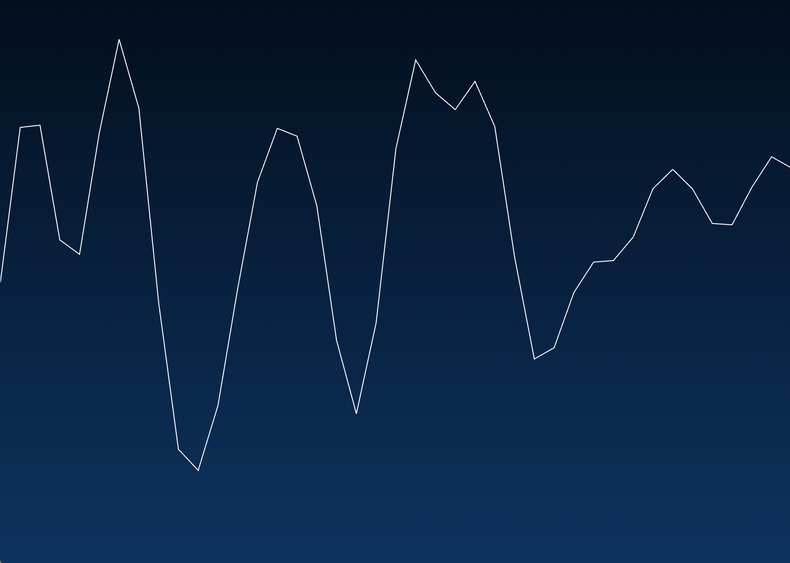
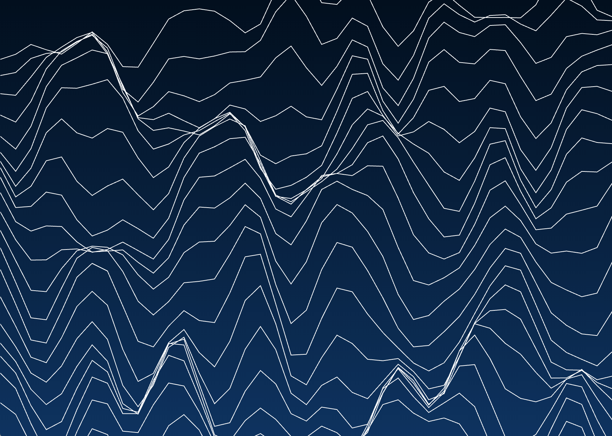
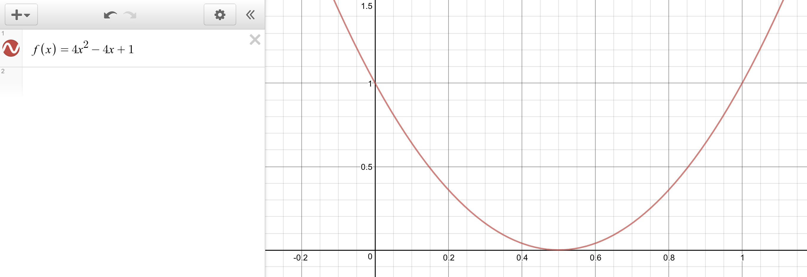
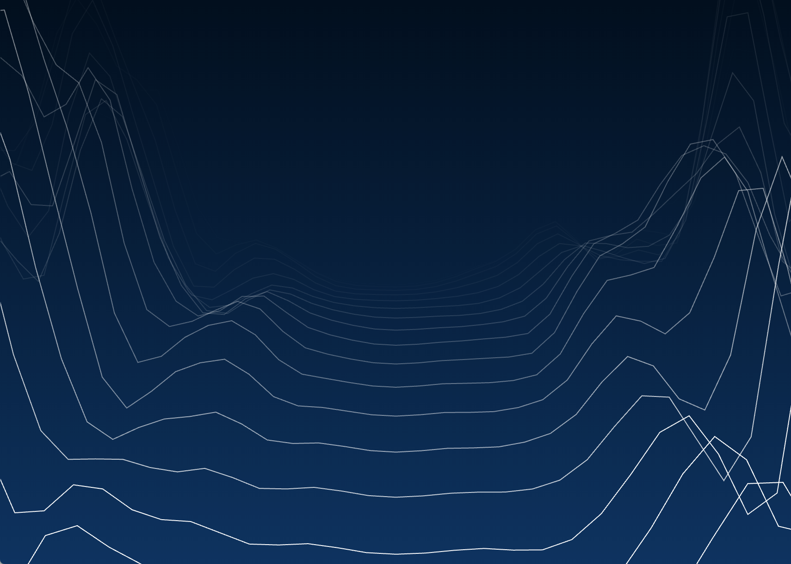

# Implementation of the animations

## Logo

Animating the logo is straight forward: the whole animation is handled through [Vivus](https://maxwellito.github.io/vivus/).

The fill opacity is initially set to 0 to only show the strokes, then [Snap.svg](http://snapsvg.io/docs/) is used to animate a fade-in on the fill opacity and reduce the stroke opacity to 0.

## Landscape

The 3D landscape is an SVG animation using CSS. The SVG elements are generated using [Snap.svg](http://snapsvg.io/docs/).

To simplify everything and being resolution-independent, a [`viewBox`](https://developer.mozilla.org/en-US/docs/Web/SVG/Attribute/viewBox) of `0 0 1 1` is used to set the coordinate system: coordinates go from 0 to 1, with the center of the screen being at `0.5, 0.5`. The problem with this approach is that stretching this square image to a rectangle will also stretch the aspect of the paths, but using the `vector-effect: non-scaling-stroke` style makes the paths exactly 1px thick on any screen / resolution.

The 3D landscape is implemented as a particle generator. Each particle is an SVG path (line) placed below the screen.

A CSS class `perspective` will animate its scaling, movement and opacity: each path will start scaled up (bigger than the screen) then shrink to exactly one screen length, and move to `y = 0.5` (middle of the screen). To enforce a feeling of actual 3D perspective, an easing function is used so that paths closer to the horizon move slower, and paths fade to an opacity of 0, simulating depth.

Paths are added to the SVG every `interval` milliseconds, and each path takes `travelTime` milliseconds to reach the horizon. This means that there will never be more than `travelTime / interval` paths on the screen. When the number of paths exceeds that, it is safe to remove the oldest path (at this point the path should have an opacity of 0).

Although most of the animation is rendered on the GPU, the number of paths displayed on screen at once is the biggest CPU bottleneck out of all the parameters.

The heights of the points in a path are not chosen randomly. Instead, they are sampled on a row in a 2D field called [Simplex noise](https://en.wikipedia.org/wiki/Simplex_noise). This noise function describes an infinite 2D plane where the values look continous in their progression.

This field is traversed row by row (the row coordinate is `simplexYOffset * simplexYStep`). A segment of length `simplexXScale` is taken from this row, and sampled at regular intervals. Each value then determines the vertical height of a point on the SVG path, making a jagged line:

By slowly increasing the y-offset (row) at which we sample these points in the simplex plane, the heights slowly move up and down in a continuous way:

Lastly, to generate a valley effect where the middle is very low and the sides high, we can multiply each of these heights with a parabola, carefully choosing its factors:

Adding in the scaling and the opacity fading, the final result is obtained:

### Notes

- Firefox has a different translation origin than Chrome. Because of how the paths are generated randomly, each path has a different overall height (bounding box). This makes the animation on Firefox look completely wrong with paths seemingly going at random vanishing points.
  
  To remedy this, two points are added to each path at the beginning and end of the list of coordinates. These points are at `-2, -2` and `2, 2`, too far away to be seen at the current scaling. This forces the bounding box of each path to be a 4x4 square, so that all paths have the same height and will be translated the same way.
- The animation doesn't look so great when it starts with a blank screen. The user has to wait `travelTime` milliseconds for the screen to be filled with the 3D landscape. To address this, a number of paths (`travelTime / interval` to be exact) are all generated at once at the start, and using a negative time with `animation-delay`, it is possible to fast-forward the state of each path to simulate an animation that has been going on for a while already.

  However, Firefox seems to have a bug in the way they handle `animation-delay`: it works but it takes an enormous amount of CPU, reducing the framerate to less than 1 fps until the paths having that CSS property are removed. For this reason, the pre-render feature is disabled on Firefox.

## Material UI transitions

## Ideas for more

- Live code typing
